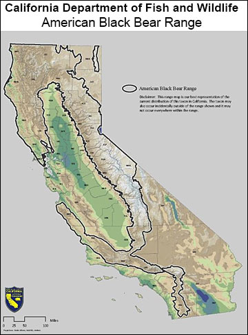

February 7, 2022

By: Blaire Hobbs

**Sneak Peak!** 

Last week, news broke that Hank the Tank, the infamous 500lb. black bear ransacking South Lake Tahoe homes was in fact [3 bears](https://www.theguardian.com/environment/2022/feb/25/very-hungry-bear-hank-the-tank-is-in-fact-three-bears-dna-shows). Thanks to DNA evidence, Hank is now off the hook, however, while Hank may be glad to no longer shoulder the blame entirely, communities and bear's alike must shoulder a potential reality where bears like Hank are showing up more often.

Due to human encroachment on the bear's habitat as well as additional climate pressures, Californians may be seeing an uptick of bears wandering into urbanized spaces as they develop preferences for human food and acclimate to human environments.

**California Bears: They're Undeniable**

------

Despite the variety of colors known to California bears, California only has one wild bear species - the Black Bear. Their fur ranges from black to tan, with occasional white chest patches. Black bears [exist across the country](https://wildlifeinformer.com/black-bear-population-by-state/#:~:text=A%20quick%20look%20at%20Black%20Bears%201%20Habitat.,sleep%20they%20go%20into%20varies.%20More%20items...%20); only nine states, including Hawaii, lack black bear populations, though even most of these have recurring sightings. In California, estimates vary, but [the current population](https://wildlife.ca.gov/Conservation/Mammals/Black-Bear) generally lands around 30,000, with an average lifespan of 18 years.

Black bears prefer densely forested areas, and thrive best in ecosystems with [structural diversity](https://www.bing.com/search?q=structural+diversity+bio&qs=n&form=QBRE&sp=-1&pq=structural+diversity+bio&sc=1-24&sk=&cvid=57176C65051C4C82877CF88B5A1693C6) - a term used to describe an area with diverse vegetation, though not just diversity of species but also diversity of height and layout. This complements the bear's diverse diet; the omnivorous black bear is an opportunistic eater, meaning it will everything available: insects, nuts, berries, grasses, some meat, and now human food as well. 

This map from the CA department of fish and wildlife shows the range of black bear's habitat in California. Note: in case it is unclear, the habitat is outlined by the black line.

While historically, black bears roamed much of North America, it's hypothesized that the large-scale hunting operations, deforestation, and permanent townships from humans in the last few centuries, drove the bears into smaller more forested zones. However in the past 50 years, this pattern has reversed and we are seeing more and more bears wandering outside their preferred habitats - especially into urban areas. 

