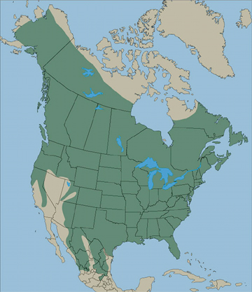

February 27, 2022

By: Blaire Hobbs

Last week, news broke that Hank the Tank, the infamous 500lb. black bear ransacking South Lake Tahoe homes was in fact [3 bears](https://www.theguardian.com/environment/2022/feb/25/very-hungry-bear-hank-the-tank-is-in-fact-three-bears-dna-shows). Thanks to DNA evidence, Hank is now off the hook, however, while Hank may be glad to no longer shoulder all the blame, communities and bear's alike must shoulder a potential reality where bears like Hank are showing up more often.

Due to human encroachment on the bear's habitat as well as additional climate pressures, Californians may be seeing an uptick of bears wandering into urbanized spaces as they develop preferences for human food and acclimate to human environments.

**California Bears: They're Undeniable**

------

Despite the variety of colors known to California bears, California only has one wild bear species - the Black Bear. Their fur ranges from black to tan, with occasional white chest patches. Black bears [exist across the country](https://wildlifeinformer.com/black-bear-population-by-state/#:~:text=A%20quick%20look%20at%20Black%20Bears%201%20Habitat.,sleep%20they%20go%20into%20varies.%20More%20items...%20); only nine states, including Hawaii, lack black bear populations, though even most of these have recurring sightings.

Black bears are considered a generalist species - they can survive in a variety of different environments from grasslands to desert to urban boundaries, however they are more densely populated in mountainous forested areas. Likewise, they thrive best in ecosystems with [structural diversity](https://www.bing.com/search?q=structural+diversity+bio&qs=n&form=QBRE&sp=-1&pq=structural+diversity+bio&sc=1-24&sk=&cvid=57176C65051C4C82877CF88B5A1693C6) - a term used to describe an area with diverse vegetation, though not just diversity of species but also diversity of height and layout. This complements the bear's diverse diet; the omnivorous black bear is an opportunistic eater, meaning it will everything available: insects, nuts, berries, grasses, some meat, and now human food as well. 

This map from the CA Department of Fish and Wildlife shows the range of black bear's habitat in California as of 2021.

Black bears are no stranger to human encroachment. It's hypothesized that the large-scale hunting operations and habitat loss from human infrastructural advancement drove bear populations down and limited their habitat.

[This image](https://bear.org/black-bear-range/) shows the historical habitat range from black bears, circa 1900, from a 1981 report on the mammals of North America. 

While their current habitat is significantly smaller, that hasn't stopped the black bear from thriving. [A 2016 assessment](https://www.iucnredlist.org/species/41687/114251609#geographic-range) from The International Union for Conservation of Nature's Red List of Threatened Species (the IUCN Red List), found them to be a species of Least Concern, the furthest a species can be from extinct. And in fact, they're numbers are increasing. In California, in 1982, their population was between 10 and 20,000. Now, [the current estimates](https://wildlife.ca.gov/Conservation/Mammals/Black-Bear) sit between 30,000-40,000. Conservation management plans, coordinated with widespread hunting operations from the California Department of Fish and Wildlife seeks to keep populations in balance, and conflicts between humans and bears at a minimum.

In modern times, there are now several things to consider about black bear's future with human populations - humans themselves, climate change, and disease.

### **Humans**

In California, most bear's live on public lands

### **Climate Change**

Climate change indiscriminately impacts everyone and everything. As a planet, we are scurrying to find ways to cope. Wildlife, too, must gradually adapt their behaviors to suit the surrounding environment, however, for some populations this may cause more acute growing pains than others as species and habitats collide.

California bears are one such species. While highly adaptable creatures, the rapidly changing environment has driven them further into urbanized and human-food laden places, creating dangerous situations for both bears and humans.

**Rising temperatures**

Among the many repercussions of climate change's rising temperatures, drought and wildfires seem to have the most impact on black bears, especially on their access to food and water. With dwindling food and water sources, as well as dwindling habitat, black bear populations are finding their ways into more temperate environments, and also more urbanized areas.

**Droughts**

**Wildfires**

### **Disease**

