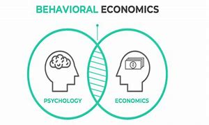
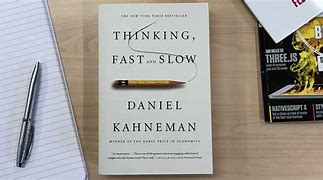
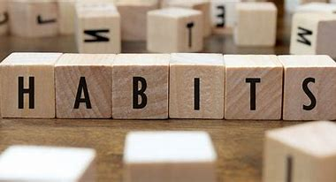
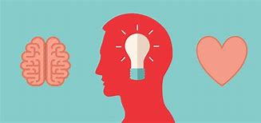

A concept most people are familiar with from one science class or another, friction is also a term applied to behavioral economics or behavioral science, and can come in handy when changing our daily behaviors. 

#### **Behavioral science** 

Behavioral science is somewhat self-explanatory - it is the study of human behavior, although it can range from studying specific behaviors, to motivations for behaviors, to behaviors linked to psychological conditions or trauma. Behavioral science is a broad discipline that can encompass anthropology, sociology, cognitive psychology, as well as behavioral economics. [[1]](https://www.chicagobooth.edu/mindworks/what-is-behavioral-science-research#:~:text=Several%20disciplines%20fall%20under%20the%20broad%20label%20of,4%20Consumer%20behavior%205%20Social%20psychology%206%20Sociology)

#### **Behavioral economics**

Behavioral economics, a subdiscipline of behavioral science, is more specific in that it examines human behavior as it relates to decision-making. While more of a psychological science in practice, it is also considered an economic discipline for how individual decision-making affects broader socio-economic trends. For instance, behavioral economists might study the proportion of people that bought one product compared to another. And why? Or what made this insurance plan, or that gym membership more popular. While behaviorist economists are curious about particular decisions, they more accurately, are curious about what made this decision so appealing out of the array of decisions available, despite the trade-offs attached to each decision. Why did they choose to buy fast food vs produce or other takeout? [[2]](https://news.uchicago.edu/explainer/what-is-behavioral-economics)

Most behaviors seem deliberate, either carefully calculated or routine given a person's principles: affirming strongly held beliefs - like the decision to attend a place of worship (if you have a particular faith) or the decision to join an extraterrestrial book club (if you believe in aliens); performing a practical or efficient task – like doing your laundry because you ran out of clean socks or doing your taxes because it's that time of year. 

Nobel Laureate and cognitive scientist Daniel Kahneman from Princeton University (and his late colleague Amos Tversky), however, has a new perspective, which generally suggests that we may not have as much control over our decisions as we think. Spoiler alert: it changed how we view psychology and behavioral economics forever.

In his 2011 book, Thinking Fast and Slow, he posits that our thinking and, because our actions are an extension of our thinking, our behavior operates on two settings: slow and fast. [[3]](https://us.macmillan.com/books/9780374533557/thinkingfastandslow) And that these settings effect our decision making in surprising ways. Although it should be noted that in summarizing these two systems (in the book, they are referred two as System 1 and System 2 respectively), I am vastly oversimplifying their nuance.

### Thinking Fast and Slow

------

#### Slow Thinking 

Slow thinking refers to decisions requiring consideration, deconstruction, or analysis. It can range from simple thought to deep deliberation. You might be navigating somewhere you’ve never been before, or answering a complex question. You might be learning a new instrument and carefully considering where to place your fingers. These actions generally take more time and brain power, but are necessary for navigating the surrounding world.

#### Fast Thinking

Fast thinking, on the other hand, applies to decisions that are automatic and require little to no thought. They are subconscious or intuitive - we have done them for so long we do them unthinkingly or we do them because of *gut instinct* – a principle not known for its scientific rigor, yet still behaviorally meaningful. This is not to say that we are being lazy; it would be impossible to think critically about every decision and movement every day – especially for activities like walking, breathing, speaking, or even putting your shoes and socks on (are you a left foot first kind of person or a right one?). Some decisions need to be automatic to free up space for things that require more thought. In a way, you could call this task prioritization. 

### Habits

------

But thinking fast is where our habits tend to catch up with us. Researchers from Duke University describe **habits** as "automated response dispositions that are cued by aspects of the performance context" [[4]](https://dornsife.usc.edu/assets/sites/208/docs/Neal.Wood.Quinn.2006.pdf), which is a fancy way of saying that habits are actions or behaviors that are intuitive, automatic, or in other words, fast thinking. And more than that, habits are cued; we perform these habits when something in our environment or preceding behavior subconsciously reminds us. For instance, looking at your phone when feeling restless or opening the fridge door when walking into the kitchen. We do them unthinkingly.

In fact, these researchers suggest that 45% of our behaviors are repeated daily. That includes a lot of actions everyday! These habits form when repeated enough through a stable environment - an environment that promotes the same routine - and an association is formed between cue and response. [[5]](https://pubmed.ncbi.nlm.nih.gov/12500811/) If you got up to drink water at 10:30 everyday, and coincidentally heard a bell at the same time - everyday after that you might get up to drink water when the bell sounds, without logically considering if you were thirsty.

With all this in mind, we can think of habits by the description offered by James Clear, NYT journalist and author of Atomic Habits: habits are small decisions you make and actions you perform every day. [[6]](https://jamesclear.com/habits)  So how do these small decisions affect or direct our lives? And how can we control them especially if they may just be impulse? 

## Friction

------

This is where does friction comes in. **Friction** refers to the factors that make it harder to accomplish our desired goals[[3\]](#_ftn3) or demotivate us from habits we otherwise would pursue. It might be obvious, but the easier a task, or the less steps involved, the more likely we are to do it. For instance, which involves more steps - elevator or staircase? While staircases involve more literal steps, this translates into metaphysical steps as well, since it takes more time and effort. Thus, friction is our staircase. Like the physical friction that slows objects down, behavioral friction makes it just a little more difficult to achieve behaviors we desire. 

When we make a decision to do something, but are unable to follow through, it is often friction that swoops in at the 11th hour and hinders our efforts. The worst part? We don't consciously register when friction impedes us - it impacts our fast thinking habits that generally don't register either. Ever wanted to stop at the grocery store on your way home, but the parking lot was full? So you think, "I'll do it tomorrow!" Friction strikes again. While we could zoom around for 15 min to find parking, the extra effort involved hinders our desire to stop.

Because we are not thinking critically about our actions when friction affects them, it is our fast thinking that is impacted. However, with careful consideration, we can determine what our fast thinking behaviors are and how friction affects them.

#### So how can we use friction to our advantage?

Friction plays two roles in our efforts. Friction is not necessarily a negative force. We can also intentionally apply it to our behaviors when trying to build new habits, and turn the previous cumbersome force, into a gratifying one. 

**1.)  Increasing:**  We can use friction to our advantage when trying to demotivate a behavior by consciously increasing friction - or making it harder to pursue that habit.

If you have a chocolate or candy affinity, placing it on the top shelf of your cupboard can help in your efforts to ditch the habit. It accomplishes two things. 1.) The candy is out of sight, thus when you're feeling snacky or bored, you might not instinctively grab for it. 2.) By keeping it out of reach, it's more difficult to get to. You might not want it because it would require additional effort to get to. You have created a staircase when previously you had an elevator.

**2.)  Reducing:** We can motivate other behaviors by reducing the frictions around them - or finding ways to make these habits easier.

Trying to eat more fruits and veggies instead of chocolate and candy? Try prepping your fruits and veggies ahead of time. Cut them into smaller pieces and keep them in a Tupperware. This makes the veggies more snackable and appealing and thus makes you more inclined to eat them when you're feeling snacky or maybe prepping other meals.

------

#### Who uses friction?

Companies, too, take friction into consideration when marketing their products and ensuring you buy. It’s in their best interest that you continue purchasing, and it’s a common practice now for company websites to ask if you would like to save your card information – they, like you, would rather you not have to get up for your wallet. Thus, by identifying and eliminating friction, they can profit.

And individuals can do the same.

If you’re looking to make changes:

- give yourself a behavioral audit 

- consider if you need to reduce or increase friction 
- set goals and work at them by adjusting your friction through trial and error

------

#### **Want more info?**

Check out [this fantastic episode](https://hiddenbrain.org/podcast/work-2-0-the-obstacles-you-dont-see/) from the podcast Hidden Brain, which discusses the relationship between friction and fuel, and provides some fascinating real world examples to contextualize this concept.